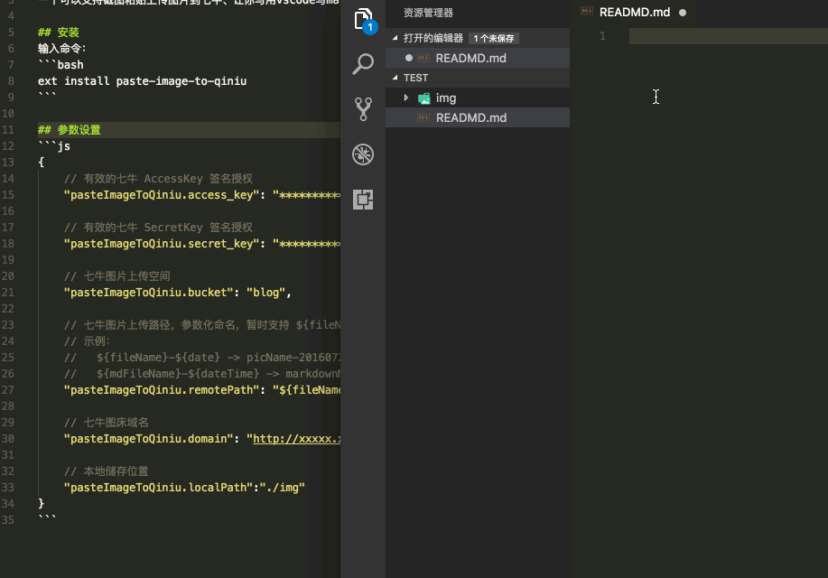

# vscode-paste-image-to-qiniu

这是一个支持直接粘贴图片文件或截图到 markdown 文档的 vscode 插件，为 vscode 的 md 文档编辑提供了更好的体验。

该项目 fork 自 github 用户 favers 的 [同名项目](https://github.com/favers/vscode-qiniu-upload-image)。 在原有功能基础上新增了一些新特性。因为提了 MR 没回应就自己上了插件。



## 新特性

在 Mac & Win 平台下可直接复制图片文件，通过插件粘贴到 markdown 文档。

## 安装
输入命令：
```bash
ext install paste-image-to-qiniu
```
或者在插件应用商店搜索paste-image-to-qiniu安装

## 参数设置
```js
{
    // 有效的七牛 AccessKey 签名授权
    "pasteImageToQiniu.access_key": "*****************************************",

    // 有效的七牛 SecretKey 签名授权
    "pasteImageToQiniu.secret_key": "*****************************************",

    // 七牛图片上传空间
    "pasteImageToQiniu.bucket": "blog",

    // 七牛图片上传路径，参数化命名，暂时支持 ${fileName}、${mdFileName}、${date}、${dateTime}
    // 示例：
    //   ${fileName}-${date} -> picName-20160725.jpg
    //   ${mdFileName}-${dateTime} -> markdownName-20170412222810.jpg
    "pasteImageToQiniu.remotePath": "${fileName}",

    // 七牛图床域名
    "pasteImageToQiniu.domain": "http://xxxxx.xxxx.com",

    // 本地储存位置
    "pasteImageToQiniu.localPath":"./img"
}
```